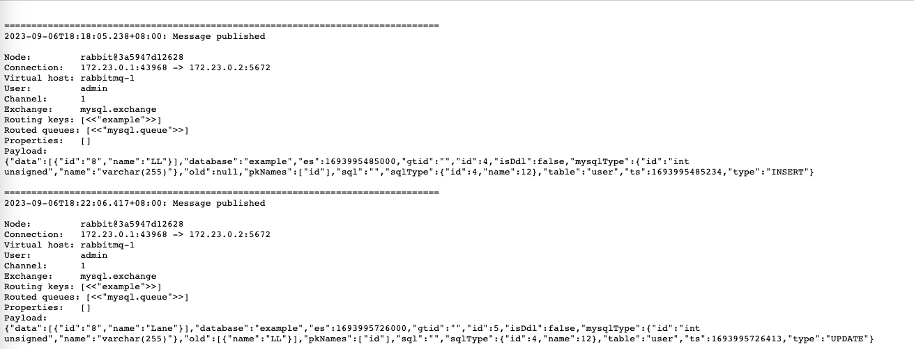

# Canal得Go版本客户端

# 配置参数说明

# 遇到的问题

# 参考文章
- https://www.cnblogs.com/lzyyyds/p/16753972.html（canal+RabbitMQ配置）
- https://www.cnblogs.com/pyyu/p/10318053.html（消息队列概念）
- https://www.cnblogs.com/baby123/p/11849650.html（RabbitMQ调试插件）



# canal投送给RabbitMQ的消息内容示例
1、插入数据
```
{"data":[{"id":"8","name":"LL"}],"database":"example","es":1693995485000,"gtid":"","id":4,"isDdl":false,"mysqlType":{"id":"int unsigned","name":"varchar(255)"},"old":null,"pkNames":["id"],"sql":"","sqlType":{"id":4,"name":12},"table":"user","ts":1693995485234,"type":"INSERT"}
```
2、更新数据（更新name为Lane）
```
{"data":[{"id":"8","name":"Lane"}],"database":"example","es":1693995726000,"gtid":"","id":5,"isDdl":false,"mysqlType":{"id":"int unsigned","name":"varchar(255)"},"old":[{"name":"LL"}],"pkNames":["id"],"sql":"","sqlType":{"id":4,"name":12},"table":"user","ts":1693995726413,"type":"UPDATE"}
```
3、删除数据
```
{"data":[{"id":"5","name":"KK"}],"database":"example","es":1693996092000,"gtid":"","id":6,"isDdl":false,"mysqlType":{"id":"int unsigned","name":"varchar(255)"},"old":null,"pkNames":["id"],"sql":"","sqlType":{"id":4,"name":12},"table":"user","ts":1693996092880,"type":"DELETE"}
```